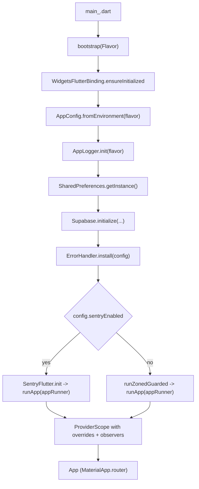

# Architecture

This doc describes the high-level shape of the codebase and the `bootstrap()` pipeline that sets up the app for every flavor. For per-area deep dives see the rest of the [`docs/`](README.md) directory.

## Layering

The codebase splits into three layers per feature, plus a `core/` layer of cross-cutting concerns.

```
lib/
  main.dart                       # always throws — see "Entrypoints" below
  main_dev.dart                   # entrypoints (one per flavor)
  main_staging.dart
  main_prod.dart
  bootstrap.dart                  # shared async setup
  src/
    app/
      app.dart                    # root MaterialApp.router
      router/                     # GoRouter + AppRoute enum
    core/
      env/                        # Flavor + AppConfig
      logging/                    # AppLogger (Talker singleton)
      error/                      # Failure, Result, ErrorMapper, ErrorHandler, AsyncValueX
      network/                    # dio_client + interceptors
      storage/                    # SecureStorage, prefs, Drift db
      theme/                      # AppTheme + tokens + ThemeController
      providers/                  # Cross-feature Riverpod handles
    features/
      auth/{data, application, presentation}
      home/presentation
      services/presentation
      activity/presentation
      account/presentation
      settings/presentation
      shell/presentation          # AppShell + FloatingNavBar
test/
integration_test/
```

Within a feature folder:

- `data/` — repository interface + SDK-specific implementation. Wraps SDK calls in `ErrorMapper.guard` and returns `Result<T, Failure>`. Never leaks `AuthException` / `PostgrestException` / `DioException` upward.
- `application/` — `@riverpod` controllers / state. Holds `AsyncValue<...>` state and orchestrates the repository.
- `presentation/` — `ConsumerWidget` / `ConsumerStatefulWidget` screens. Watches the controller, renders via `AsyncValueX.whenWidget`, listens for errors via `showSnackBarOnError`.

Only `auth` currently has all three layers in full; the other features are presentation-only placeholders.

## Entrypoints

Three entrypoints exist, one per flavor:

- [`lib/main_dev.dart`](../lib/main_dev.dart) → `bootstrap(Flavor.dev)`
- [`lib/main_staging.dart`](../lib/main_staging.dart) → `bootstrap(Flavor.staging)`
- [`lib/main_prod.dart`](../lib/main_prod.dart) → `bootstrap(Flavor.prod)`

[`lib/main.dart`](../lib/main.dart) is **not** a real entrypoint — running `flutter run -t lib/main.dart` throws `UnsupportedError` so a missing `--flavor` / `-t` / `--dart-define-from-file` triple fails loudly instead of silently picking up wrong config.

The flavor passed in by the entrypoint is then cross-checked against the `FLAVOR` value in the env file inside [`AppConfig.fromEnvironment`](../lib/src/core/env/app_config.dart) — see [`env-and-flavors.md`](env-and-flavors.md).

## `bootstrap()` pipeline

The single bootstrap routine lives in [`lib/bootstrap.dart`](../lib/bootstrap.dart). Order matters because each step assumes the previous ones have run.



### Step-by-step

1. **Bindings.** `WidgetsFlutterBinding.ensureInitialized()` so plugins can be invoked before `runApp`.
2. **Config.** [`AppConfig.fromEnvironment(flavor)`](../lib/src/core/env/app_config.dart) reads compile-time `String.fromEnvironment` values, validates that the env file's `FLAVOR` matches the entrypoint, and requires `SUPABASE_URL` + `SUPABASE_ANON_KEY` to be non-empty (otherwise `StateError`). This is the **only** place in the codebase that should call `String.fromEnvironment`.
3. **Logger.** [`AppLogger.init(flavor)`](../lib/src/core/logging/app_logger.dart) builds the process-wide `Talker` singleton with `maxHistoryItems` 200 in prod / 1000 elsewhere.
4. **Prefs + Supabase.** `SharedPreferences.getInstance()` is awaited, then `Supabase.initialize(url, anonKey, debug: !flavor.isProd)`.
   - Non-obvious: the doc comment says "concurrently" but the actual calls are **sequential** (`await` on prefs first, then `await` on Supabase). Functionally equivalent for normal launches.
5. **Error sinks.** [`ErrorHandler.install(config)`](../lib/src/core/error/error_handler.dart) wires `FlutterError.onError` and `PlatformDispatcher.instance.onError` into Talker, with conditional Sentry capture when a DSN is configured.
6. **Run.** A local `appRunner()` builds `ProviderScope` with:
   - `observers: [TalkerRiverpodObserver(talker: AppLogger.instance)]`
   - overrides for `appConfigProvider` and `sharedPreferencesProvider`
   - `child: const App()`

   Then either:
   - **Sentry enabled (`config.sentryEnabled`)** — `SentryFlutter.init(...)` owns the zone; `appRunner()` is invoked from its `appRunner:` callback. Tracing sample rate is `0.2` in prod and `1.0` elsewhere; environment is `flavor.name`; release is `config.appName`.
   - **Sentry disabled** — Talker logs the skip, then `runZonedGuarded(runApp(appRunner()), …)` forwards zone errors to `AppLogger.instance.handle(..., 'runZonedGuarded')`.

## The root widget

[`lib/src/app/app.dart`](../lib/src/app/app.dart) holds no state of its own. It watches three providers and hands them to `MaterialApp.router`:

- [`appRouterProvider`](../lib/src/app/router/app_router.dart) → `routerConfig`
- [`themeControllerProvider`](../lib/src/core/theme/theme_controller.dart) → `themeMode`
- [`appConfigProvider`](../lib/src/core/providers/app_config_provider.dart) → `title: config.appName`

Light/dark themes both come from [`AppTheme`](../lib/src/core/theme/app_theme.dart). `debugShowCheckedModeBanner` is forced off so screenshots from any flavor look the same.

## Cross-cutting providers

Two providers default to throwing and **must** be overridden by `bootstrap()` (or by tests via `pump_app.dart`):

- [`appConfigProvider`](../lib/src/core/providers/app_config_provider.dart)
- [`sharedPreferencesProvider`](../lib/src/core/storage/prefs.dart)

This is the project's convention for "values that exist before the widget tree runs". Anywhere else that you need to inject a real instance from `bootstrap()` should follow the same pattern (declare the provider with a throwing default, override in `bootstrap()`, override with a fake in tests).

## Where to look next

- [`routing-and-shell.md`](routing-and-shell.md) — what happens after `App` mounts.
- [`env-and-flavors.md`](env-and-flavors.md) — how `--dart-define-from-file` lines up with native flavors.
- [`observability.md`](observability.md) — how Talker + Sentry get wired into every layer touched here.
