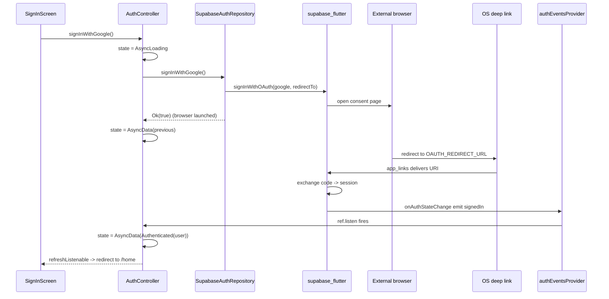

# Authentication

Auth is the only feature in the template that exercises every layer of the architecture: an SDK-agnostic repository wrapping `supabase_flutter`, a Riverpod controller exposing `AsyncValue<AuthState>`, sign-in / sign-up / splash screens, and a Google OAuth flow that completes asynchronously through a deep link.

## Files

| File | Description |
| --- | --- |
| [`lib/src/features/auth/data/auth_repository.dart`](../lib/src/features/auth/data/auth_repository.dart) | `AuthRepository` interface, `SupabaseAuthRepository` implementation, `authRepositoryProvider`. All public methods return `Result<...>`. Generated `auth_repository.g.dart` exposes the provider. |
| [`lib/src/features/auth/application/auth_state.dart`](../lib/src/features/auth/application/auth_state.dart) | Sealed `AuthState` (`AuthInitial` / `Authenticated(User)` / `Unauthenticated`). Generated `auth_state.freezed.dart`. |
| [`lib/src/features/auth/application/auth_controller.dart`](../lib/src/features/auth/application/auth_controller.dart) | `authEventsProvider` (Supabase auth event stream) and `AuthController`, the single source of truth for "is the user signed in?". Generated `auth_controller.g.dart`. |
| [`lib/src/features/auth/presentation/sign_in_screen.dart`](../lib/src/features/auth/presentation/sign_in_screen.dart) | Email/password form + Google button, listens for auth errors → SnackBar. |
| [`lib/src/features/auth/presentation/sign_up_screen.dart`](../lib/src/features/auth/presentation/sign_up_screen.dart) | Sign-up + confirm password + Google button. |
| [`lib/src/features/auth/presentation/splash_screen.dart`](../lib/src/features/auth/presentation/splash_screen.dart) | Centered `CircularProgressIndicator` shown while auth resolves. |
| [`lib/src/features/auth/presentation/widgets/auth_form_field.dart`](../lib/src/features/auth/presentation/widgets/auth_form_field.dart) | `AuthFormField`, `AuthValidators`, `AuthDivider`, and `GoogleSignInButton` (custom-painted glyph, no asset). |

## `AuthRepository` (data layer)

[`AuthRepository`](../lib/src/features/auth/data/auth_repository.dart) is the boundary between the rest of the app and Supabase. The contract:

- `Stream<sb.AuthState> get onAuthStateChange` — direct passthrough to the SDK stream.
- `sb.User? get currentUser` — synchronous current-session lookup.
- `Future<Result<sb.User>> signInWithPassword({email, password})`
- `Future<Result<sb.User?>> signUpWithPassword({email, password})`
- `Future<Result<bool>> signInWithGoogle()` — returns success of the **launch**, not the full session.
- `Future<Result<void>> signOut()`
- `Future<Result<void>> sendPasswordReset(String email)`

Every public method funnels through [`ErrorMapper.guard`](../lib/src/core/error/error_mapper.dart) so callers see `Result<T, Failure>`, never raw `AuthException` / `PostgrestException`. See [`error-handling.md`](error-handling.md) for the full mapping.

### `SupabaseAuthRepository`

The default implementation. Constructor accepts an `oauthRedirectUrl` (read from [`AppConfig`](../lib/src/core/env/app_config.dart)), an optional `SupabaseClient` (defaults to `Supabase.instance.client`), and an optional `ErrorMapper`. The `client` getter is `@visibleForTesting` for tests that want to inspect SDK state.

Non-obvious behavior:

- **Password sign-in** — if `signInWithPassword` returns a response with `user == null`, the wrapper throws `AuthException('Sign-in returned no user')` inside `guard`, which becomes `Failure.auth`. So callers always see either an `Ok(User)` or `Err(AuthFailure)`, never a successful-but-empty result.
- **Sign-up** — `res.user` can be **null when email confirmation is required**. The repo passes that through as `Ok(null)` (not an error). Controllers then map `null` to `Unauthenticated`.
- **Google OAuth** — `signInWithOAuth(OAuthProvider.google, redirectTo: …)` returns when the external browser launches, not when the session arrives. If `oauthRedirectUrl` is empty, `redirectTo` is passed as `null`. See "Google OAuth flow" below.
- **`sendPasswordReset`** is implemented but **no UI calls it yet**.

`authRepositoryProvider` is `@Riverpod(keepAlive: true)` so the repository persists for the whole app session and the `onAuthStateChange` stream stays subscribed.

## `AuthState` (sealed union)

[`AuthState`](../lib/src/features/auth/application/auth_state.dart) is a `freezed` sealed class with three variants:

- `AuthInitial` — declared but **not emitted** by the controller (see "Non-obvious" below).
- `Authenticated(sb.User user)`
- `Unauthenticated`

Convenience getters: `isAuthenticated`, `isUnauthenticated`.

## `AuthController` (application layer)

[`AuthController`](../lib/src/features/auth/application/auth_controller.dart) is `@Riverpod(keepAlive: true) class AuthController extends _$AuthController` with a `Future<AuthState> build()`.

### Lifecycle

In `build()`:

1. Watch the repository.
2. `ref.listen(authEventsProvider, …)` — every emission projects `event.session?.user` into an `AuthState` and pushes it into `state` as `AsyncData<AuthState>`. Sentry user scope is synced on every change.
3. Synchronous initial state: `_project(repo.currentUser)`. Sentry sync runs once with the initial value.

Non-obvious: `authEventsProvider` is a separate `@Riverpod(keepAlive: true)` `StreamProvider` over `repo.onAuthStateChange`. The controller `ref.listen`s to it (not the raw stream), so subscription lifecycle is handled by Riverpod.

### Mutations

| Method | Behavior |
| --- | --- |
| `signIn({email, password})` | Sets `AsyncLoading`, calls `repo.signInWithPassword`, applies `Authenticated.new` mapping, then `AsyncData` or `AsyncError`. |
| `signUp({email, password})` | Same shape; if the repo returns `Ok(null)` (email confirmation pending) the state becomes `Unauthenticated`. |
| `signInWithGoogle()` | Captures previous `state.requireValue` (or `Unauthenticated`), sets `AsyncLoading`, calls `repo.signInWithGoogle`. **On `Ok`, restores the previous state** instead of flipping to `Authenticated` — the actual session arrives later via `authEventsProvider` once Supabase redirects back through the deep link. On `Err`, flips to `AsyncError`. |
| `signOut()` | `AsyncLoading` → call repo → map `Ok` to `Unauthenticated`. |

`_stackOf(Failure)` extracts the original stack trace (or `StackTrace.empty`) so `AsyncError` carries through whatever Sentry / Talker can use.

### Sentry user sync

`_syncSentryUser(AuthState)` is called on every state change. When Sentry is initialized (`Sentry.isEnabled`), it calls `Sentry.configureScope` to set or clear the user (`SentryUser(id, email)`). The Sentry scope APIs are intentionally fire-and-forget here — see the `// ignore: discarded_futures` comment.

### Why `AuthInitial` is effectively unused

`AuthController.build` resolves the **initial** state directly via `_project(repo.currentUser)` — which returns either `Authenticated` or `Unauthenticated` synchronously. The router's `AuthInitial` arm in `redirect` (see [`routing-and-shell.md`](routing-and-shell.md)) is therefore dormant unless something else changes.

## Screens (presentation layer)

### `SignInScreen`

[`sign_in_screen.dart`](../lib/src/features/auth/presentation/sign_in_screen.dart) — `ConsumerStatefulWidget` with form keys `signIn.email`, `signIn.password`, `signIn.submit`, `signIn.google` (used by the widget tests). Submission calls `ref.read(authControllerProvider.notifier).signIn(...)`. A `ref.listen` on `authControllerProvider` triggers `next.showSnackBarOnError(context)` — see [`error-handling.md`](error-handling.md). The submit button shows a 20×20 spinner while `auth.isLoading`.

### `SignUpScreen`

Mirror of sign-in with a confirm-password field, additional validation (passwords match), and the same Google button. Both screens link to each other via `context.goNamed(AppRoute.<x>.name)`.

### `SplashScreen`

[`splash_screen.dart`](../lib/src/features/auth/presentation/splash_screen.dart) — just a centered `CircularProgressIndicator`. The router's `redirect` keeps the user here while `authControllerProvider` is loading or `!hasValue`.

### `GoogleSignInButton`

Lives inside [`auth_form_field.dart`](../lib/src/features/auth/presentation/widgets/auth_form_field.dart) (no separate file). The "G" glyph is custom-painted, so there is no asset to add.

## Google OAuth flow (deep link round-trip)

Three things must agree on the same URL — see also [`env-and-flavors.md`](env-and-flavors.md):

| Where | What |
| --- | --- |
| [`env/<flavor>.json`](../env/example.json) → `OAUTH_REDIRECT_URL` | `com.example.app.auth://login-callback` (template default) |
| [`android/app/src/main/AndroidManifest.xml`](../android/app/src/main/AndroidManifest.xml) | `<data android:scheme=… android:host=…/>` intent-filter |
| [`ios/Runner/Info.plist`](../ios/Runner/Info.plist) → `CFBundleURLTypes` | `CFBundleURLSchemes` array |
| Supabase dashboard → Authentication → URL Configuration | Add the same URL to the redirect allow-list |

If you change the bundle ID, update the scheme/host in all four places **and** enable the Google provider in the Supabase dashboard with your Google Cloud OAuth client ID/secret.

## See also

- [`error-handling.md`](error-handling.md) — `Result<T>` / `Failure` / `ErrorMapper.guard` mechanics referenced throughout the repository.
- [`routing-and-shell.md`](routing-and-shell.md) — how `authControllerProvider` drives the router's `redirect`.
- [`testing.md`](testing.md) — `FakeAuthRepository` and the existing controller + widget tests.
- [`observability.md`](observability.md) — how Sentry user scope is kept in sync from `_syncSentryUser`.
