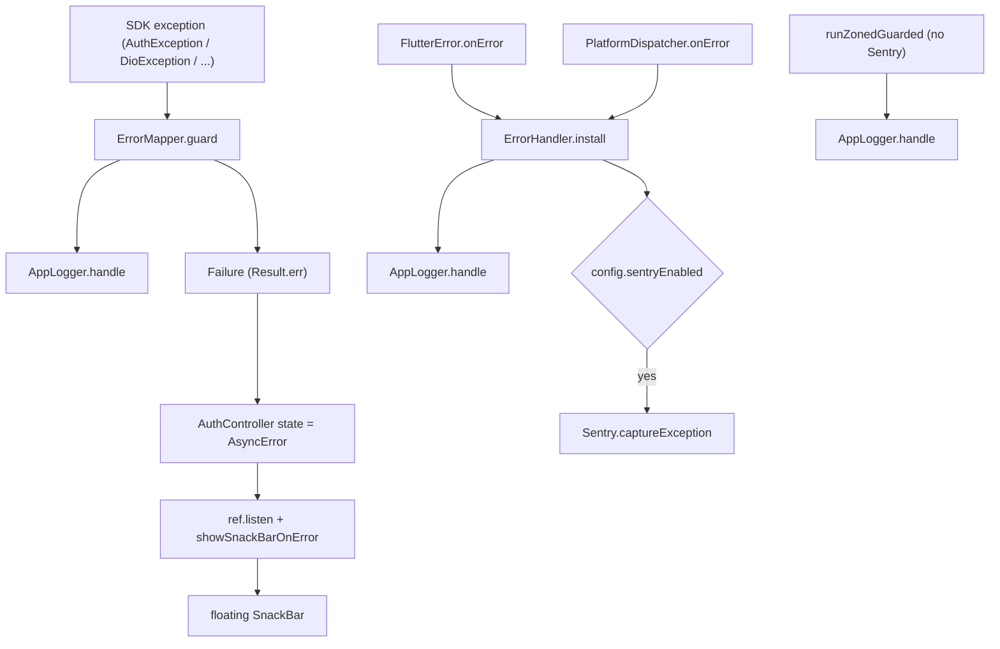

# Error Handling

The error story has four pieces: a sealed `Failure` type, a `Result<T>` for repository return values, an `ErrorMapper` that converts SDK exceptions into `Failure`s, and a process-wide `ErrorHandler` that wires Flutter's three error sinks into Talker (and optionally Sentry). UI consumes `AsyncValue<...>` through `AsyncValueX` helpers so loading / error / data rendering stays consistent.

## Files

| File | Description |
| --- | --- |
| [`lib/src/core/error/failure.dart`](../lib/src/core/error/failure.dart) | Freezed sealed `Failure` (`network` / `auth` / `server` / `validation` / `unknown`) + `displayMessage`. Generated `failure.freezed.dart`. |
| [`lib/src/core/error/result.dart`](../lib/src/core/error/result.dart) | Hand-written sealed `Result<T>` with `Ok` / `Err`, `map`, `when`, `valueOrNull`, `failureOrNull`. |
| [`lib/src/core/error/error_mapper.dart`](../lib/src/core/error/error_mapper.dart) | `ErrorMapper.guard` — wraps an async block and returns `Result<T>`, translating SDK exceptions and logging via Talker. |
| [`lib/src/core/error/error_handler.dart`](../lib/src/core/error/error_handler.dart) | `ErrorHandler.install(config)` wires `FlutterError.onError` and `PlatformDispatcher.onError`; `ErrorHandler.report(...)` for ad-hoc capture. |
| [`lib/src/core/error/async_value_x.dart`](../lib/src/core/error/async_value_x.dart) | `AsyncValueX.whenWidget` (loading/error/data widget builder) and `AsyncValueListenerX.showSnackBarOnError`. |

## `Failure` (sealed)

[`Failure`](../lib/src/core/error/failure.dart) is the only error type the rest of the app should see. Variants:

| Variant | Constructor | When to use |
| --- | --- | --- |
| `NetworkFailure` | `Failure.network({message, statusCode?, cause?, stackTrace?})` | Connectivity / DNS / timeout / 5xx-from-edge problems. |
| `AuthFailure` | `Failure.auth({message, code?, cause?, stackTrace?})` | 4xx auth issues, expired tokens, etc. |
| `ServerFailure` | `Failure.server({message, statusCode?, cause?, stackTrace?})` | Backend returned a structured error that isn't auth-related. |
| `ValidationFailure` | `Failure.validation({message, field?})` | Local validation problem worth surfacing inline next to a field. |
| `UnknownFailure` | `Failure.unknown({message, cause?, stackTrace?})` | Catch-all. Should be reported to Sentry with the original `cause` / `stackTrace`. |

`displayMessage` returns the variant's `message` for SnackBars, banners, etc.

## `Result<T>`

[`Result<T>`](../lib/src/core/error/result.dart) is a small hand-rolled `Either` substitute. The project deliberately avoids `dartz` / `fpdart` — Dart 3's pattern matching is enough.

```dart
final result = await repo.signIn(email, password);
switch (result) {
  case Ok(:final value):
    // value is the success type
  case Err(:final failure):
    // failure is a Failure
}
```

API:

| Member | Notes |
| --- | --- |
| `Result.ok(value)` / `Ok<T>(value)` | Success constructor. |
| `Result.err(failure)` / `Err<T>(failure)` | Failure constructor. |
| `bool get isOk` / `bool get isErr` | Quick checks. |
| `T? get valueOrNull` | Success value or `null`. |
| `Failure? get failureOrNull` | Failure or `null`. |
| `Result<R> map<R>(R Function(T))` | Maps the success arm; failures pass through. |
| `R when<R>({required ok, required err})` | Folds both arms into a single value. |

`Ok<T>` and `Err<T>` are `final class` with structural `==` / `hashCode` / `toString`.

## `ErrorMapper.guard`

[`ErrorMapper`](../lib/src/core/error/error_mapper.dart) is the **only place** in the app that catches SDK exceptions. Repositories wrap async work with `guard`:

```dart
@override
Future<Result<sb.User>> signInWithPassword({...}) {
  return _mapper.guard(() async {
    final res = await _client.auth.signInWithPassword(...);
    final user = res.user;
    if (user == null) throw const sb.AuthException('Sign-in returned no user');
    return user;
  });
}
```

### Mapping table

`guard` matches in this order. Every catch logs to `AppLogger.instance.handle(error, stackTrace, label)` before returning the `Err`.

| Caught | `Failure` | Notes |
| --- | --- | --- |
| `AuthException` (Supabase) | `Failure.auth(message, code: e.statusCode, cause, stackTrace)` | |
| `PostgrestException` | `Failure.server(message, statusCode: int.tryParse(e.code ?? ''), cause, stackTrace)` | |
| `DioException` | `_mapDio(e, st)` (see below) | |
| `SocketException` | `Failure.network(message: 'No internet connection', cause, stackTrace)` | |
| `TimeoutException` | `Failure.network(message: 'Request timed out', cause, stackTrace)` | |
| Anything else (`Object`) | `Failure.unknown(message: e.toString(), cause, stackTrace)` | |

`_mapDio(DioException, StackTrace)` — second-pass routing for Dio errors:

| `e.type` | `Failure` |
| --- | --- |
| `connectionTimeout`, `receiveTimeout`, `sendTimeout` | `Failure.network('Request timed out')` |
| `connectionError` | `Failure.network('Connection error')` |
| `badResponse` with status `401` or `403` | `Failure.auth('Not authorized', code: status.toString())` |
| `badResponse` (other) | `Failure.server(message: e.response?.statusMessage ?? 'Server error', statusCode: status)` |
| `cancel` | `Failure.unknown('Request cancelled')` |
| `badCertificate`, `unknown` | `Failure.unknown(e.message ?? 'Unknown network error')` |

## `ErrorHandler` (process-wide)

[`ErrorHandler.install(AppConfig)`](../lib/src/core/error/error_handler.dart) is called from [`bootstrap()`](../lib/bootstrap.dart) **after** `AppLogger.init` and **before** `runApp`. It wires:

- `FlutterError.onError` — synchronous framework errors.
  - The original `FlutterError.onError` handler is captured first and called inside the new handler so any default behavior is preserved.
  - Always logs to Talker with context `FlutterError: <details.context.toDescription>`.
  - When `config.sentryEnabled`, also `unawaited(_safeCapture(..., source: 'FlutterError.onError'))`.
- `PlatformDispatcher.instance.onError` — uncaught async errors.
  - Logs to Talker, optionally Sentry.
  - Returns `true` (marks the error handled).

`runZonedGuarded` is set up by [`bootstrap()`](../lib/bootstrap.dart) itself when Sentry is disabled — its callback forwards everything to `AppLogger.instance.handle(..., 'runZonedGuarded')`. With Sentry enabled, `SentryFlutter.init` owns the zone and that branch isn't used. See [`observability.md`](observability.md).

### `ErrorHandler.report`

Use this when you've explicitly caught something at a controller / use-case layer and still want it on Sentry:

```dart
await ErrorHandler.report(error, stackTrace, context: 'feature.x', extras: {...});
```

It always logs via Talker. If `Sentry.isEnabled`, it `Sentry.captureException` with the `context` set as a tag and each `extras` entry attached via `scope.setContexts`. Prefer `ErrorMapper.guard` in repositories — `report` is the escape hatch for the rare cases where `guard` doesn't fit.

`_safeCapture(error, stack?, source)` is the private helper used by `install` — it short-circuits when `!Sentry.isEnabled` so a missing Sentry init is a no-op rather than a crash.

## `AsyncValueX` UI helpers

[`async_value_x.dart`](../lib/src/core/error/async_value_x.dart) holds two extensions on `AsyncValue`:

### `whenWidget`

```dart
ref.watch(controller).whenWidget(
  data: (value) => MyContent(value),
  // optional:
  // loading: () => ...,
  // error: (err, st) => ...,
);
```

Defaults: a centered `CircularProgressIndicator` for loading; a centered, padded, centered-text `Text(err.toString())` for error. Use this everywhere instead of duplicating `.when(loading: …, error: …, data: …)` blocks.

### `showSnackBarOnError`

```dart
ref.listen(authControllerProvider, (_, next) {
  next.showSnackBarOnError(context);
});
```

Only fires when `hasError && !isLoading`. Hides any current SnackBar first, then shows a floating SnackBar with `error.toString()`. Used by [`SignInScreen`](../lib/src/features/auth/presentation/sign_in_screen.dart), [`SignUpScreen`](../lib/src/features/auth/presentation/sign_up_screen.dart), and [`SettingsScreen`](../lib/src/features/settings/presentation/settings_screen.dart).

## Where errors actually go



## See also

- [`auth.md`](auth.md) — `AuthController._stackOf` extracts a stack trace from each `Failure` variant for `AsyncError`.
- [`network.md`](network.md) — Dio's interceptors run before `guard` ever catches.
- [`observability.md`](observability.md) — what Talker / Sentry actually do with the events.
