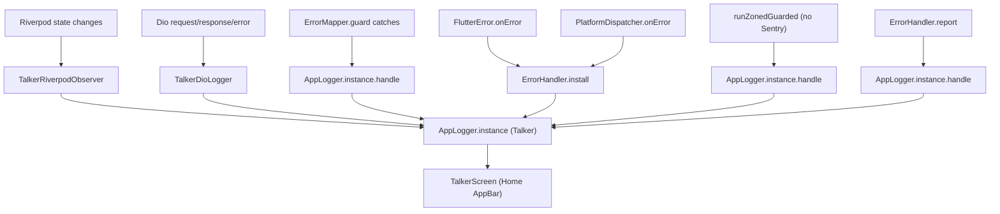

# Logging and Observability

Logging is centralized through a single Talker instance owned by `AppLogger`. Every layer that needs to log — Riverpod state changes, Dio requests, error mapping, framework / async / zone errors — pipes into the same instance so the in-app `TalkerScreen` log viewer shows a unified timeline. Sentry is opt-in via `SENTRY_DSN`: when set, `bootstrap()` initializes `SentryFlutter`, the Dio client adds `sentry_dio`, the `ErrorHandler` mirrors framework/async errors to Sentry, and `AuthController` keeps the Sentry user scope in sync.

## Files

| File | Description |
| --- | --- |
| [`lib/src/core/logging/app_logger.dart`](../lib/src/core/logging/app_logger.dart) | Process-wide Talker singleton. `AppLogger.init(Flavor)` and `AppLogger.instance`. |
| [`lib/bootstrap.dart`](../lib/bootstrap.dart) | Calls `AppLogger.init` early; conditionally inits Sentry; wires `TalkerRiverpodObserver` into `ProviderScope`; falls back to `runZonedGuarded` when Sentry is disabled. |
| [`lib/src/core/error/error_handler.dart`](../lib/src/core/error/error_handler.dart) | Mirrors `FlutterError.onError` and `PlatformDispatcher.onError` to Talker (always) and Sentry (when enabled). |
| [`lib/src/core/network/dio_client.dart`](../lib/src/core/network/dio_client.dart) | Adds `TalkerDioLogger` always and `dio.addSentry()` when `config.sentryEnabled`. |
| [`lib/src/features/auth/application/auth_controller.dart`](../lib/src/features/auth/application/auth_controller.dart) | `_syncSentryUser` configures `Sentry.configureScope` on every auth state change. |
| [`lib/src/features/home/presentation/home_screen.dart`](../lib/src/features/home/presentation/home_screen.dart) | AppBar action opens `TalkerScreen(talker: AppLogger.instance)` for the in-app log viewer. |

## `AppLogger`

[`AppLogger`](../lib/src/core/logging/app_logger.dart) wraps a single `Talker` instance.

```dart
class AppLogger {
  AppLogger._();
  static Talker? _instance;
  static Talker get instance { /* asserts initialized */ }
  static Talker init(Flavor flavor) {
    final talker = TalkerFlutter.init(
      settings: TalkerSettings(maxHistoryItems: flavor.isProd ? 200 : 1000),
    );
    _instance = talker;
    talker.info('AppLogger initialised for flavor=${flavor.name}');
    return talker;
  }
}
```

- `maxHistoryItems` — 200 in prod, 1000 in dev/staging. The bigger ring buffer makes the in-app viewer more useful while iterating; the smaller one keeps memory bounded in production.
- `init` is safe to call multiple times in tests; the previous instance is replaced.
- The `instance` getter `assert`s that `init` has been called — never instantiate `Talker()` ad hoc anywhere else.

## Where logs come from



### Riverpod observer

`bootstrap.dart` registers a `TalkerRiverpodObserver(talker: AppLogger.instance)` on the `ProviderScope`, so every provider build / dispose / update / error gets logged.

### Dio interceptor

`dioProvider` adds `TalkerDioLogger(talker: AppLogger.instance)` to every Dio instance — see [`network.md`](network.md).

### Repository error mapping

`ErrorMapper.guard` calls `AppLogger.instance.handle(error, stackTrace, label)` for every caught exception before returning `Err(...)`. The `label` distinguishes sources in the log feed (`'Supabase AuthException'`, `'DioException'`, etc.) — see [`error-handling.md`](error-handling.md).

### Process-wide error sinks

`ErrorHandler.install`:

- `FlutterError.onError` → calls the original (preserving previous behavior) → `AppLogger.instance.handle(...)` → optional Sentry capture.
- `PlatformDispatcher.instance.onError` → `AppLogger.instance.handle(...)` → optional Sentry → returns `true`.

When Sentry is **disabled**, `bootstrap` wraps `runApp` in `runZonedGuarded`. The zone error handler forwards everything to `AppLogger.instance.handle(error, stack, 'runZonedGuarded')`. (When Sentry is enabled, `SentryFlutter.init` owns the zone instead.)

### Manual reporting

`ErrorHandler.report(error, stackTrace, context: ..., extras: {...})` is the escape hatch for code that catches manually but still wants Talker + Sentry. Always logs to Talker; only forwards to Sentry when `Sentry.isEnabled`.

## Sentry

Sentry is gated entirely on `config.sentryEnabled` (i.e. `SENTRY_DSN` non-empty). When disabled, every Sentry call short-circuits and `bootstrap` falls back to `runZonedGuarded`.

### Init in `bootstrap`

```dart
if (config.sentryEnabled) {
  await SentryFlutter.init(
    (o) => o
      ..dsn = config.sentryDsn
      ..environment = flavor.name
      ..release = config.appName
      ..tracesSampleRate = flavor.isProd ? 0.2 : 1.0
      ..attachStacktrace = true,
    appRunner: () => runApp(appRunner()),
  );
}
```

| Setting | Value |
| --- | --- |
| `dsn` | `config.sentryDsn` |
| `environment` | `flavor.name` (`dev` / `staging` / `prod`) |
| `release` | `config.appName` (Sentry's release tag) |
| `tracesSampleRate` | `0.2` in prod, `1.0` elsewhere |
| `attachStacktrace` | `true` |

### Dio integration

`dio.addSentry()` (from `sentry_dio`) is added in [`dioProvider`](../lib/src/core/network/dio_client.dart) when `config.sentryEnabled`. Failed HTTP requests appear as Sentry breadcrumbs / events.

### User scope

[`AuthController._syncSentryUser`](../lib/src/features/auth/application/auth_controller.dart) is called on every auth state change:

| State | Action |
| --- | --- |
| `Authenticated(user)` | `scope.setUser(SentryUser(id: user.id, email: user.email))` |
| `Unauthenticated` / `AuthInitial` | `scope.setUser(null)` |

The `Sentry.configureScope` callback is intentionally fire-and-forget (`// ignore: discarded_futures`). Wrapped in `if (!Sentry.isEnabled) return;` so it's a no-op when Sentry is disabled.

### Mirror of error sinks

`ErrorHandler` calls `_safeCapture` from both `FlutterError.onError` and `PlatformDispatcher.onError`, with `withScope: (scope) => scope.setTag('source', source)`. `_safeCapture` short-circuits when `!Sentry.isEnabled`.

## In-app log viewer

[`HomeScreen`](../lib/src/features/home/presentation/home_screen.dart) places a bug-report `IconButton` in the AppBar that pushes a `TalkerScreen(talker: AppLogger.instance)` on top. Because every layer logs into the same Talker, the screen shows a unified timeline of Riverpod state changes, HTTP traffic, and errors — extremely handy for catching issues in dev/staging builds without needing a debugger attached.

## See also

- [`error-handling.md`](error-handling.md) — exactly which exceptions become which Talker labels.
- [`network.md`](network.md) — Dio interceptors that write to the same log.
- [`auth.md`](auth.md) — `_syncSentryUser` lifecycle.
- [`env-and-flavors.md`](env-and-flavors.md) — `SENTRY_DSN` controls everything Sentry-related.
