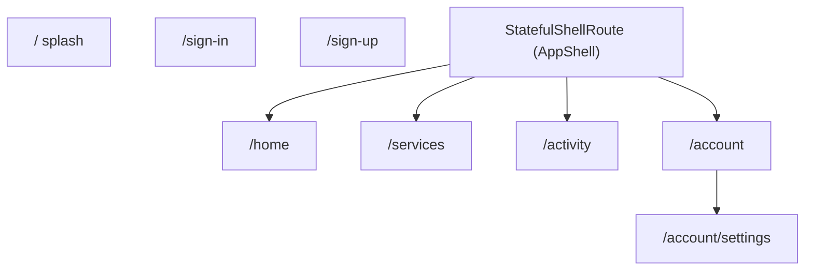

# Routing and Navigation Shell

Navigation is built around a single `GoRouter` instance held by Riverpod, an `AppRoute` enum that owns route names and paths, an auth-aware `redirect` function, and a `StatefulShellRoute` that hosts four bottom-tab branches under a custom `FloatingNavBar`.

## Files

| File | Description |
| --- | --- |
| [`lib/src/app/router/app_router.dart`](../lib/src/app/router/app_router.dart) | `appRouter(Ref)` provider builds the `GoRouter`, wires the auth refresh notifier, defines `redirect`, and lists all routes. Generated `app_router.g.dart` exposes `appRouterProvider`. |
| [`lib/src/app/router/routes.dart`](../lib/src/app/router/routes.dart) | `AppRoute` enum — the single source of truth for route names + paths. |
| [`lib/src/features/shell/presentation/app_shell.dart`](../lib/src/features/shell/presentation/app_shell.dart) | Stateful shell widget. `Stack`s the `navigationShell` under a floating bottom bar. |
| [`lib/src/features/shell/presentation/widgets/floating_nav_bar.dart`](../lib/src/features/shell/presentation/widgets/floating_nav_bar.dart) | Pill-shaped floating nav bar UI + `FloatingNavItem` model. |

## `AppRoute` enum

[`AppRoute`](../lib/src/app/router/routes.dart) centralises every route name and path so refactors propagate automatically. Always reference routes by `AppRoute.<x>.name` / `.path` rather than hard-coded strings.

| Enum | name | path |
| --- | --- | --- |
| `splash` | `splash` | `/` |
| `signIn` | `sign-in` | `/sign-in` |
| `signUp` | `sign-up` | `/sign-up` |
| `home` | `home` | `/home` |
| `services` | `services` | `/services` |
| `activity` | `activity` | `/activity` |
| `account` | `account` | `/account` |
| `settings` | `settings` | `/account/settings` |

Note: "typed" routes here means the enum, not `go_router_builder` codegen — the project does not use `@TypedGoRoute`.

## `GoRouter` configuration

`appRouter(Ref)` is a `@Riverpod(keepAlive: true)` function that builds and returns the `GoRouter`. Highlights:

- `initialLocation: AppRoute.splash.path` — every cold start lands on `/`.
- `debugLogDiagnostics: kDebugMode` — verbose go_router logs only in debug.
- `refreshListenable: _GoRouterRefreshNotifier(ref)` — see below.

### Auth-aware refresh

[`_GoRouterRefreshNotifier`](../lib/src/app/router/app_router.dart) is a tiny `ChangeNotifier` whose constructor calls `ref.listen(authControllerProvider, …)` and forwards every emission to `notifyListeners()`. `GoRouter` re-runs `redirect` whenever the listenable fires, so any sign-in / sign-out causes the redirect logic below to re-evaluate.

`appRouter` is `keepAlive: true` so the `GoRouter` (and the listener it owns) live for the whole app session; `ref.onDispose(notifier.dispose)` ensures cleanup if the provider ever does get disposed (e.g. in tests).

### `redirect` rules

Reading [`appRouter`](../lib/src/app/router/app_router.dart):

1. **Auth still resolving (`auth.isLoading || !auth.hasValue`).** Stay on splash; redirect anything else to splash.
2. **`Authenticated`.** If on `/sign-in`, `/sign-up`, or `/` → redirect to `/home`. Otherwise no change.
3. **`Unauthenticated`.** If on `/sign-in` or `/sign-up` → no change. Otherwise → `/sign-in`. (Deep links into shell routes get bounced to sign-in.)
4. **`AuthInitial`.** If on splash → no change. Otherwise → splash.

Non-obvious: the `AuthInitial` arm is **effectively dead code** today. [`AuthController.build`](../lib/src/features/auth/application/auth_controller.dart) projects `currentUser` directly into `Authenticated` or `Unauthenticated` without ever emitting `AuthInitial`. The arm is kept for safety in case someone extends `AuthController` to use that state explicitly.

### Route tree

The four shell branches each own their own `Navigator`, so swapping tabs preserves nested navigation state per branch (`StatefulShellRoute.indexedStack`). Settings is **not** a fifth tab — it lives under the account branch and is reached by tapping into the account screen.

## `AppShell` and `FloatingNavBar`

[`AppShell`](../lib/src/features/shell/presentation/app_shell.dart) is a `StatelessWidget` that receives the `StatefulNavigationShell` and renders:

- `Positioned.fill(child: navigationShell)` — full-bleed branch content.
- A floating `FloatingNavBar` overlaid at `bottom: viewPadding.bottom + 12`, inset `16` from each side.

Tab item list is hard-coded in `_items`:

| Branch index | Label | Icons | Notes |
| --- | --- | --- | --- |
| 0 | Home | `home_outlined` / `home_rounded` | |
| 1 | Services | `apps_outlined` / `apps_rounded` | |
| 2 | Activity | `receipt_long_outlined` / `receipt_long_rounded` | |
| 3 | Account | `person_outline` / `person_rounded` | `showBadge: true` (decorative red dot, not data-driven) |

`onTap` calls `navigationShell.goBranch(i, initialLocation: i == currentIndex)` — tapping the **active** tab pops that branch's nested navigator back to its root, which is the standard tab-bar behavior users expect.

[`FloatingNavBar`](../lib/src/features/shell/presentation/widgets/floating_nav_bar.dart) is a pill-shaped `Material` container that pulls colors and radii from the [`AppColors`](../lib/src/core/theme/tokens/app_colors.dart) `ThemeExtension` (via `context.appColors`) and [`AppRadii`](../lib/src/core/theme/tokens/app_radii.dart) — see [`theming.md`](theming.md).

## Screens reachable from each route

| Path | Widget |
| --- | --- |
| `/` | `SplashScreen` — centered `CircularProgressIndicator` while auth resolves |
| `/sign-in` | [`SignInScreen`](../lib/src/features/auth/presentation/sign_in_screen.dart) |
| `/sign-up` | [`SignUpScreen`](../lib/src/features/auth/presentation/sign_up_screen.dart) |
| `/home` | [`HomeScreen`](../lib/src/features/home/presentation/home_screen.dart) — opens `TalkerScreen` from the AppBar |
| `/services` | `ServicesScreen` placeholder |
| `/activity` | `ActivityScreen` placeholder |
| `/account` | `AccountScreen` — avatar tile, navigates to settings |
| `/account/settings` | [`SettingsScreen`](../lib/src/features/settings/presentation/settings_screen.dart) — theme radios + sign-out |

## See also

- [`auth.md`](auth.md) — the `authControllerProvider` driving `redirect`.
- [`architecture.md`](architecture.md) — where `appRouterProvider` plugs into the root `App` widget.
- [`theming.md`](theming.md) — how the floating nav bar inherits colors/radii.
